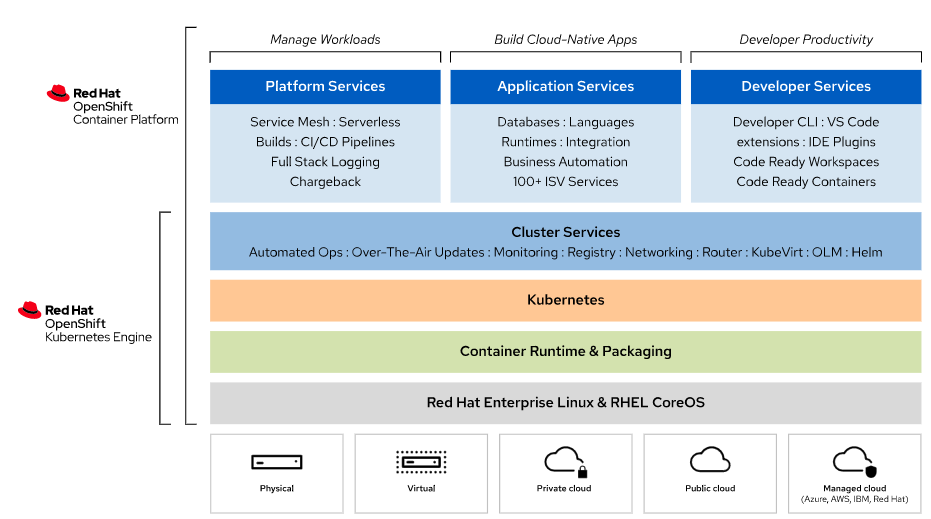
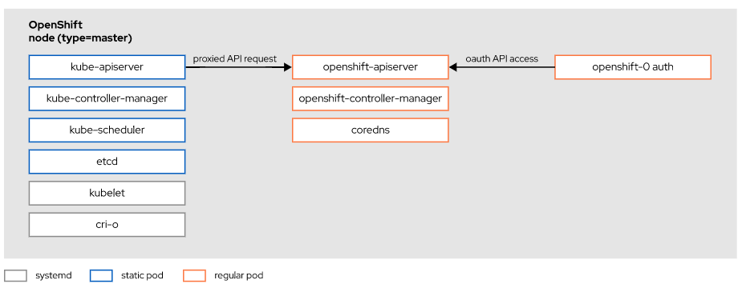

# Red Hat OpenShift Container Platform
## OpenShift Container Platform Features  


## Openshift Features


## Openshift Control Plane 
  
version: Openshift 4.5

## Openshift Cluster Operators  
- Kubernetes Operators  
    - Operators usually define custom resources (CR) that store their settings and configurations.  
    - The syntax of a custom resource is defined by a custom resource definition (CRD).  
    - An OpenShift administrator manages an operator by editing its custom resources.  

- Openshift Cluster Operators manages some following list of cluster operator: 
    - network  
    - ingress  
    - storage  
    - authentication  
    - console  
    - monitoring  
    - image-registry  
    - cluster-autoscaler  
    - openshift-apiserver  
    - dns  
    - openshift-controller-manager  
    - cloud-credential  
  

- Operator  
    - An application that manages Kubernetes resources.  
- Operator SDK  
    - An open source toolkit for building, testing, and packaging operators.  
- Operator Catalog  
    - A repository for discovering and installing operators.  
- Custom Resource Definition (CRD)  
    - An extension of the Kubernetes API that defines the syntax of a custom resource.  
- Operator Lifecycle Manager (OLM)  
    - An application that manages Kubernetes operators.  
- OperatorHub  
    - A public web service where you can publish operators that are compatible with the OLM.  
- Operator Image  
    - The artifact defined by the Operator Framework that you can publish for consumption by an OLM instance.  


## Troubleshooting OpenShift Clusters and Applications  
### Verifying the Health of OpenShift Nodes  
- `oc get nodes`  
```bash
NAME       STATUS   ROLES           AGE   VERSION
master01   Ready    master,worker   2d    v1.18.3+012b3ec
master02   Ready    master,worker   2d    v1.18.3+012b3ec
master03   Ready    master,worker   2d    v1.18.3+012b3ec
```

- `oc adm top nodes`  
Displays the current CPU and memory usage of each node.  
These are actual usage numbers, not the resource requests that the OpenShift scheduler considers as the available and used capacity of the node.  
```bash
NAME       CPU(cores)   CPU%   MEMORY(bytes)   MEMORY%
master01   499m         14%    3235Mi          21%
master02   769m         21%    4933Mi          33%
master03   1016m        29%    6087Mi          40%
```


## # AAA
#### # BBB

#### # Template
<details>
<summary>template</summary>
</details>
