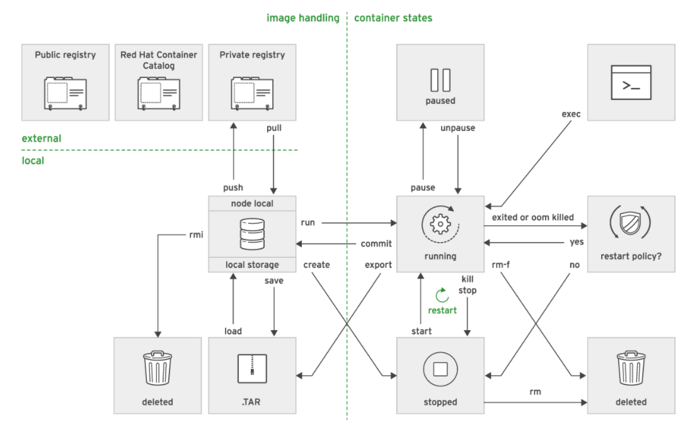

# Learn Openshift

#### # Deploy app from GitHub
```bash
$ oc new-app --name version https://github.com/fahmifahim/DO101-apps#update-app --context-dir version

$ oc get all
        NAME                           READY   STATUS      RESTARTS   AGE
        pod/version-1-build            0/1     Completed   0          12m
        pod/version-6886df6f44-b6d6v   1/1     Running     0          10m

        NAME              TYPE        CLUSTER-IP      EXTERNAL-IP   PORT(S)    AGE
        service/version   ClusterIP   172.30.203.24   <none>        8080/TCP   12m

        NAME                      READY   UP-TO-DATE   AVAILABLE   AGE
        deployment.apps/version   1/1     1            1           12m

        NAME                                 DESIRED   CURRENT   READY   AGE
        replicaset.apps/version-6886df6f44   1         1         1       10m
        replicaset.apps/version-b66c8c69c    0         0         0       12m

        NAME                                     TYPE     FROM             LATEST
        buildconfig.build.openshift.io/version   Source   Git@update-app   1

        NAME                                 TYPE     FROM          STATUS     STARTED          DURATION
        build.build.openshift.io/version-1   Source   Git@6459e50   Complete   12 minutes ago   1m37s

        NAME                                     IMAGE REPOSITORY                                                                             TAGS     UPDATED
        imagestream.image.openshift.io/version   default-route-openshift-image-registry.apps.ocp-ap3.prod.nextcle.com/fahmi-version/version   latest   10 minutes ago

$ oc get svc
        NAME      TYPE        CLUSTER-IP      EXTERNAL-IP   PORT(S)    AGE
        version   ClusterIP   172.30.203.24   <none>        8080/TCP   23m

$ oc expose svc/version
        route.route.openshift.io/version exposed

$ oc get routes
        NAME      HOST/PORT                                             PATH   SERVICES   PORT       TERMINATION   WILDCARD
        version   version-fahmi-version.apps.ocp-ap3.prod.nextcle.com          version    8080-tcp                 None

```

#### # Configuring the Horizontal Pod Autoscaler
-  Some applications receive a large number of concurrent requests only during certain periods, which makes it very difficult to size the number of pods up front before running the application. However, there are extra costs associated with running more pods than required when traffic is not at its peak.

- Red Hat OpenShift Container Platform refers to the action of changing the number of pods for an application as scaling. Scaling up refers to increasing the number of pods for an application. Scaling down refers to decreasing that number. Scaling up allows the application to handle more client requests, and scaling down provides cost savings when the load goes down. 

- When scaling up an application, the OpenShift platform first deploys a new pod and then waits for the pod to be ready. Only after the new pod becomes available does the OpenShift platform configure the route to also send traffic to the new pod. 

- When scaling down, OpenShift reconfigures the route to stop sending traffic to the pod, and then deletes the pod. 

```bash
$ oc autoscale dc/frontend --min=1 --max=5 --cpu-percent=80

The options are as follows:

dc/frontend
    Name of the application deployment configuration resource 

--min=1
    Minimum number of pods 

--max=5
    Maximum number of pods. HPA does not scale up the application beyond this limit, even if the load continues to increase. 

--cpu-percent=80
    Ideal average CPU utilization for each pod. If the global average CPU utilization is above that value, then HPA starts a new pod. If the global average CPU utilization is below the value, then HPA deletes a pod. 
```


## # Creating Containerized Services
### # Provisioning Containerized Services
#### # Managing Containers with Podman
- Podman is an open source tool for managing containers and container images and interacting with image registries. Some of the following key features:
    - It uses image format specified by the Open Container Initiative (OCI). It define an standard, community-driven, non-proprietary image format.
    - It stores local images in local file-system. It avoids unnecessary client/server architecture or having daemons running on local machine.
    - It follows the same command patterns as the Docker CLI, no need to learn a new toolset.
    - Podman compatible with Kubernetes. 

#### # Fetching Container Images with Podman
```bash
$ sudo podman search rhel
		INDEX      NAME                            DESCRIPTION  STARS OFFICIAL AUTOMATED
		redhat.com registry.access.redhat.com/rhel This plat... 0
		
$ sudo podman pull rhel
		Trying to pull registry.access.redhat.com/rhel...Getting image source signatures
		Copying blob sha256: ...output omitted...
		 72.25 MB / 72.25 MB [======================================================] 8s
		Writing manifest to image destination
		Storing signatures
		699d44bc6ea2b9fb23e7899bd4023d3c83894d3be64b12e65a3fe63e2c70f0ef

$ sudo podman images
        REPOSITORY                        TAG      IMAGE ID       CREATED       SIZE
        registry.access.redhat.com/rhel   latest   699d44bc6ea2   4 days ago    214MB
```

#### # Running Containers
- Podman command options: 
    - -t or --tty, meaning a pseudo-tty (pseudo-terminal) is to be allocated for the container.
    - -i or --interactive. When used, standard input is kept open into the container.
    - -d or --detach, means the container runs in the background (detached). Podman prints the container id.

```bash
$ sudo podman run rhel:latest echo 'Hello!'
        Hello!

$ sudo podman run -d rhscl/httpd-24-rhel7:2.4-36.5
        ff4ec6d74e9b2a7b55c49f138e56f8bc46fe2a09c23093664fea7febc3dfa1b2
```

- Exercise
    1. Creating MYSQL Database instance
    ```bash
    $ sudo podman run --name mysql-basic \
            > -e MYSQL_USER=user1 -e MYSQL_PASSWORD=mypa55 \
            > -e MYSQL_DATABASE=items -e MYSQL_ROOT_PASSWORD=r00tpa55 \
            > -d rhscl/mysql-57-rhel7:5.7-3.14
            Trying to pull ...output omitted...
            Copying blob sha256:e373541...output omitted...
            69.66 MB / 69.66 MB [===================================================] 8s
            Writing manifest to image destination
            Storing signatures
            92eaa6b67da0475745b2beffa7e0895391ab34ab3bf1ded99363bb09279a24a0
    ```

    - Verify containers
    ```bash
    $ sudo podman ps --format "{{.ID}} {{.Image}} {{.Names}}"
            92eaa6b67da0 registry.access.redhat.com/rhscl/mysql-57-rhel7:5.7-3.14 mysql-basic
    ```

    - Access the container 
    ```bash
    $ sudo podman exec -it mysql-basic /bin/bash
            bash-4.2$
    ```

    - Access the mysql database and put some entries
    ```bash
    bash-4.2$ mysql -uroot
            Welcome to the MySQL monitor.  Commands end with ; or \g.
            ...output omitted...
    mysql> 

    mysql> show databases;
            +--------------------+
            | Database           |
            +--------------------+
            | information_schema |
            | items              |
            | mysql              |
            | performance_schema |
            | sys                |
            +--------------------+
            5 rows in set (0.01 sec)

    mysql> use items;
            Database changed

    mysql> CREATE TABLE Projects (id int(11) NOT NULL,
        -> name varchar(255) DEFAULT NULL,
        -> code varchar(255) DEFAULT NULL,
        -> PRIMARY KEY (id));
            Query OK, 0 rows affected (0.01 sec)

    mysql> show tables;
            +---------------------+
            | Tables_in_items     |
            +---------------------+
            | Projects            |
            +---------------------+
            1 row in set (0.00 sec)

    mysql> insert into Projects (id, name, code) values (1,'DevOps','AAO180');
            Query OK, 1 row affected (0.02 sec)

    mysql> select * from Projects;
            +----+-----------+-------+
            | id | name      | code  |
            +----------------+-------+
            |  1 | DevOps    | AAO180 |
            +----------------+-------+
            1 row in set (0.00 sec)

    mysql> exit
            Bye
    bash-4.2$ exit
            exit
    ```

    2. Creating Web-Service apps
    ```bash
    # Start HTTP-Apache container 
    $ sudo podman run -d -p 8080:80 --name httpd-basic redhattraining/httpd-parent:2.4

    # Test the container
    $ curl http://localhost:8080

    # Change the display message to HOLA!!
    $ sudo podman exec -it httpd-basic /bin/bash
        bash-4.4# 
        bash-4.4# echo "HOLA!!" > /var/www/html/index.html
        bash-4.4# exit

    # Test the container
    $ curl http://localhost:8080

    ```


## # Managing Containers
### # Managing the Life Cycle of Containers
#### # Container Life Cycle Management with Podman
- Podman managed subcommands for container life cycle management
        
